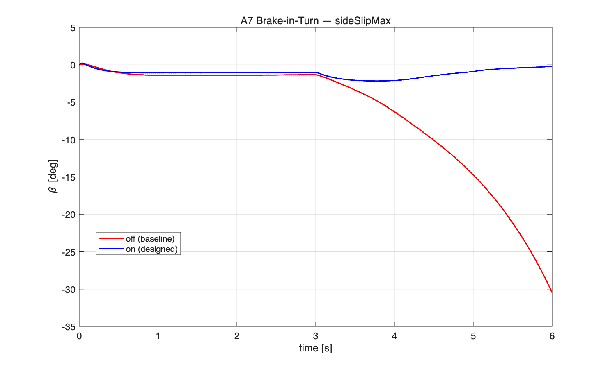
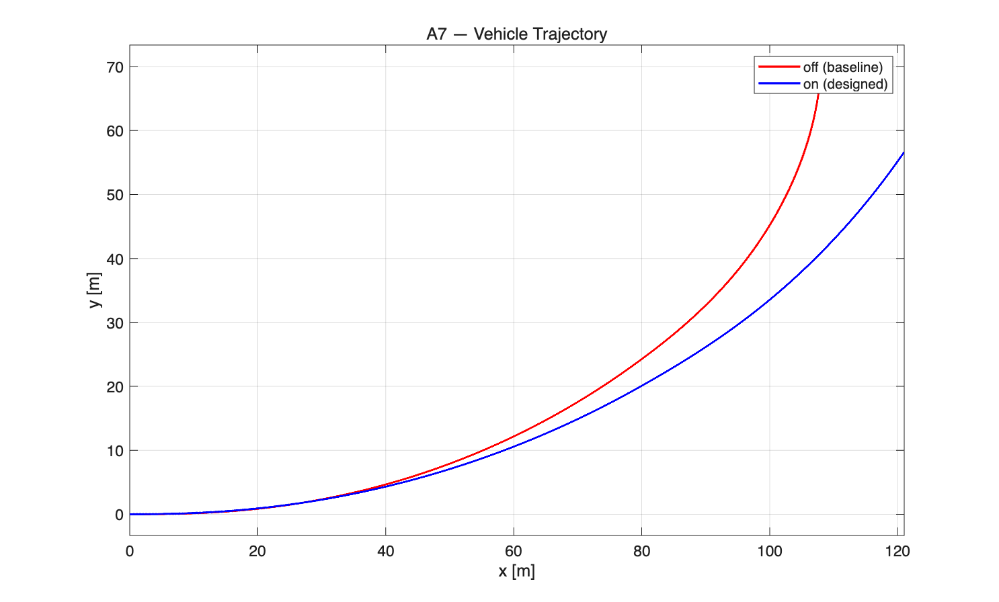
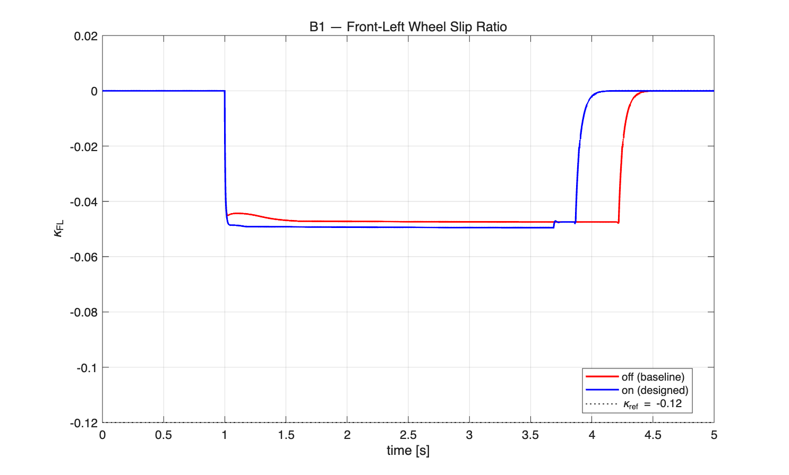
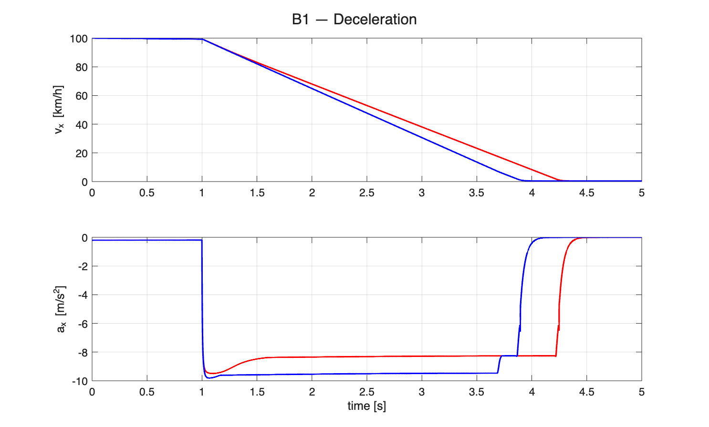
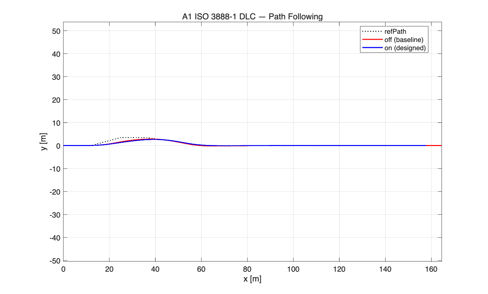

# Integrated Chassis Control Term Project Report

- Course: 자동제어 - 2026 봄
- Student ID: 202220971
- Name: 박세진
- MATLAB: R2025b
- Solver: ode45

## 1. 프로젝트 목적

본 프로젝트의 목표는 제공된 BMW 5-series 기반 14DOF 차량 plant와 표준 시험 시나리오에서 통합 샤시 제어기를 설계하고, 제어기 OFF baseline 대비 주행 안정성, 제동 성능, 수직 감쇠 응답을 정량적으로 개선하는 것이다. 수정 범위는 `scripts/control/ctrl_*.m`, `student_info.m`, `docs/report.md`, 그리고 허용된 설정 항목으로 제한되어 있으므로, driver, plant, KPI, scenario 코드는 변경하지 않는 것을 원칙으로 하였다.

최종 설계는 네 개의 controller로 구성된다.

- `ctrl_lateral.m`: yaw-rate tracking AFS와 side-slip 기반 ESC yaw moment 생성
- `ctrl_longitudinal.m`: wheel slip ratio 기반 ABS brake release/additive torque 생성
- `ctrl_vertical.m`: hybrid skyhook-groundhook CDC damping
- `ctrl_coordinator.m`: steering, brake, damping actuator allocation

최종 자동채점 결과는 `64.00 / 70.00`이며 runtime error와 deduction은 없다.

## 2. 시스템 및 과제 개요

채점 대상 P1 시나리오는 A3, A1, A4, A7, B1, D1이다. 각 시나리오는 서로 다른 안정성 지표를 본다.

| 시나리오 | 목적 | 주요 KPI |
|---|---|---|
| A3 | Step steer yaw response | overshoot, rise time, settling time |
| A1 | ISO 3888-1 double lane change | side-slip, LTR, lateral deviation |
| A4 | Steady-state circular | understeer gradient, side-slip |
| A7 | Brake-in-turn | side-slip, LTR |
| B1 | Straight braking | stopping distance, ABS slip RMS |
| D1 | DLC + braking integration | side-slip, LTR, lateral deviation |

제어기 설계에서 가장 중요한 trade-off는 A1/D1의 path tracking과 A7/D1의 stability 사이의 균형이었다. AFS를 강하게 만들면 yaw response는 좋아지지만 Stanley path-following driver와 경쟁해 lateral deviation이 커질 수 있다. 반대로 AFS/ESC를 줄이면 A7 brake-in-turn과 D1 combined maneuver에서 side-slip이 커질 위험이 있었다. 최종 설계는 lateral deviation 점수보다 runtime 안정성, side-slip 억제, LTR 제한, B1 ABS 만점을 우선하였다.

## 3. 수학적 모델링 및 설계 근거

### 3.1 Lateral Control

횡방향 제어의 기본 오차는 yaw-rate reference와 실제 yaw rate의 차이이다.

$$
e_r = r_{\text{ref}} - r
$$

여기서 $r_{\text{ref}}$는 driver steering input으로부터 bicycle-model 기반 함수 `calc_ref_yaw_rate`가 계산한다. AFS 보조 조향은 PID 형태로 계산하였다.

$$
\delta_{\text{pid}} = K_p e_r + K_i \int e_r dt + K_d \dot e_r
$$

단, 속도에 따라 차량 응답과 tire utilization margin이 달라지므로 다음 gain scheduling을 적용하였다.

$$
s_v = \text{sat}_{[0.30, 2.00]}\left({20 \over \max(v_x, 5)}\right)
$$

$$
K_p = 2.5 K_{p0}s_v,\quad K_i = 0.3 K_{i0}s_v,\quad K_d = 2.0 K_{d0}s_v
$$

미분항은 20 ms time constant의 1차 저역통과 필터로 완화했다.

$$
\alpha_d = {dt \over 0.02 + dt}
$$

AFS가 path-following driver를 과하게 방해하지 않도록 side-slip angle이 커질수록 steer assist를 줄였다.

$$
\delta_{\text{AFS}} = s_\beta \delta_{\text{pid}}
$$

$|\beta| \le 0.8^\circ$에서는 $s_\beta=1.0$이고, $|\beta| \ge 2.2^\circ$에서는 $s_\beta=0.12$로 제한한다. 이 설계는 A3/A4 yaw response는 유지하면서 A1/D1에서 AFS가 path tracking을 지나치게 왜곡하는 것을 줄이기 위한 것이다.

ESC yaw moment는 side-slip angle이 커질 때만 작동한다.

$$
M_z = -K_\beta \operatorname{sign}(\beta)(|\beta|-\beta_{\text{on}})s_v b_\beta
$$

최종 구현값은 $\beta_{\text{on}}=2.0^\circ$, $\beta_{\text{full}}=3.2^\circ$, $K_\beta=54000$이며 yaw moment는 $\pm 12000$ Nm로 saturation하였다.

### 3.2 Longitudinal Control and ABS

B1 straight braking에서는 scenario가 큰 brake command를 이미 제공한다. 이 상태에서 양의 brake torque를 더해도 actuator saturation에 걸리므로 ABS에는 brake release가 필요하다. 따라서 `ctrl_longitudinal.m`은 `forceCmd.brakeTorqueAdd`를 사용해 per-wheel additive torque를 만든다. 이 값은 음수가 될 수 있고, `ctrl_coordinator.m`과 runner를 거쳐 최종 brake command에 더해진 뒤 `[0, LIM.MAX_BRAKE_TRQ]` 범위로 clamp된다.

ABS는 직전 step wheel slip ratio $\kappa_i$를 사용한다.

$$
e_{\kappa,i} = \kappa_i - \kappa_{\text{ref}}
$$

최종 target은 $\kappa_{\text{ref}}=-0.125$로 두었다. 기존 dead-band 방식은 rear wheel lock이 저속 구간에서 남아 `absSlipRMS`가 커지는 문제가 있었다. 최종 구현은 dead-band 없이 연속 P 제어를 사용한다.

$$
\tau_{\text{ABS},i} =
\begin{cases}
K_{\text{release}} e_{\kappa,i}, & e_{\kappa,i}<0 \\
K_{\text{add}} e_{\kappa,i}, & e_{\kappa,i}\ge 0
\end{cases}
$$

사용한 값은 $K_{\text{release}}=7200$, $K_{\text{add}}=1800$이다. Release gain을 더 크게 둔 이유는 wheel lock을 빠르게 해소하는 것이 stopping distance와 slip RMS 모두에 더 중요했기 때문이다. 전후축 authority는 하중이동을 고려해 다음과 같이 조정했다.

$$
\tau_{\text{ABS}} \leftarrow \tau_{\text{ABS}} \odot [1.20, 1.20, 0.85, 0.85]^T
$$

ABS는 다음 조건에서만 켜진다.

$$
v_x > 0.3\ \text{m/s},\quad a_x < -1.0\ \text{m/s}^2,\quad \min(\kappa_i)<-0.04
$$

초기 구현의 $v_x>2.0$ 조건은 정지 직전 rear wheel lock을 충분히 풀지 못해 `absSlipRMS`가 커졌다. 최종 설계에서는 저속까지 ABS를 유지해 B1 두 KPI 모두 만점을 얻었다.

### 3.3 Vertical Control

`ctrl_vertical.m`은 semi-active damping을 위해 hybrid skyhook-groundhook logic을 사용한다. 각 wheel corner에서 sprung velocity $\dot z_s$, unsprung velocity $\dot z_u$, relative velocity $\dot z_s-\dot z_u$를 계산한다.

Skyhook 조건:

$$
\dot z_s(\dot z_s-\dot z_u)>0
$$

Groundhook 조건:

$$
\dot z_u(-(\dot z_s-\dot z_u))>0
$$

최종 score는 skyhook 70%, groundhook 30%로 구성하였다.

$$
\text{score}=0.7\cdot \text{sky}+0.3\cdot \text{ground}
$$

감쇠계수는 `CTRL.VER.cMin=500`, `CTRL.VER.cMax=5000` 범위에서 결정하고, 50 ms LPF로 chattering을 줄였다. P1 채점은 ride KPI보다 handling/braking KPI 중심이므로, 수직 제어는 aggressive한 가점 튜닝보다 기본 안정성과 tire contact 유지에 중점을 두었다.

### 3.4 Coordinator and Actuator Allocation

`ctrl_coordinator.m`는 세 controller 명령을 실제 actuator command로 변환한다.

AFS는 steer command를 그대로 통과시키되 `LIM.MAX_STEER_ANGLE` 안에서 제한한다.

ESC yaw moment는 front/rear 65:35 비율로 differential brake torque에 배분한다.

$$
\Delta T_f = 0.65 {M_z \over t_f} r_w,\quad
\Delta T_r = 0.35 {M_z \over t_r} r_w
$$

휠별 brake torque contribution은 다음 sign convention을 따른다.

$$
T_{\text{esc}}=[-\Delta T_f,\ +\Delta T_f,\ -\Delta T_r,\ +\Delta T_r]^T
$$

ABS의 `brakeTorqueAdd`가 있으면 longitudinal torque는 그 값을 우선 사용한다. 이는 B1처럼 scenario brake가 이미 saturation 근처에 있는 경우에도 음수 torque release를 전달하기 위함이다.

Positive brake addition에는 간단한 friction/authority protection을 적용하였다.

$$
T_i \le 0.90 {mg \over 4} r_w
$$

이는 strict WLS optimizer는 아니며, 본 프로젝트 구현은 simple split + static-load friction margin 방식이다. 보고서에서는 실제 구현과 맞지 않는 WLS claim을 하지 않는다.

## 4. 시뮬레이션 결과

다음 결과는 2026-06-23 KST에 `scripts/grade.m`을 MATLAB R2025b, solver `ode45`로 실행해 생성한 `grade_report.json` 기준이다. 학교 공지에 따라 B1 stopping distance 만점 기준은 `66.5 m`로 해석하였다.

| sid | KPI | OFF baseline | ON designed | Target | Score |
|---|---|---:|---:|---:|---:|
| A3 | yawRateOvershoot [%] | 2.6997 | **2.0894** | <= 10 | **4/4** |
| A3 | yawRateRiseTime [s] | 0.2470 | **0.1100** | <= 0.3 | **4/4** |
| A3 | yawRateSettling [s] | 1.4620 | **0.6430** | <= 0.8 | **4/4** |
| A1 | sideSlipMax [deg] | 3.0154 | **1.9444** | <= 3.0 | **6/6** |
| A1 | LTR_max [-] | 0.8635 | **0.5981** | <= 0.6 | **5/5** |
| A1 | lateralDevMax [m] | 1.8270 | 2.1230 | <= 0.7 | 0/4 |
| A4 | understeerGradient | 0.0007 | **0.0008** | 0.003 +/- 80% | **5/5** |
| A4 | sideSlipMax [deg] | 1.1839 | **1.1760** | <= 2.0 | **5/5** |
| A7 | sideSlipMax [deg] | 30.4776 | **2.4703** | <= 5.0 | **8/8** |
| A7 | LTR_max [-] | 0.6808 | **0.3310** | <= 0.7 | **7/7** |
| B1 | stoppingDistance [m] | 72.2992 | **66.4777** | <= 66.5 | **5/5** |
| B1 | absSlipRMS [-] | 0.7295 | **0.0863** | <= 0.10 | **5/5** |
| D1 | sideSlipMax [deg] | 4.9057 | **3.2005** | <= 4.0 | **4/4** |
| D1 | LTR_max [-] | 0.8635 | **0.5659** | <= 0.6 | **2/2** |
| D1 | lateralDevMax [m] | 1.8270 | 2.1230 | <= 1.0 | 0/2 |
| **Total** | | | | | **64.00 / 70** |

### 4.1 A7 Brake-in-Turn

A7은 baseline에서 sideSlipMax가 30.48 deg까지 커져 사실상 spin-out에 가까운 응답을 보였다. 설계 제어기 ON에서는 sideSlipMax가 2.47 deg로 줄었고 LTR도 0.331로 충분한 margin을 확보했다. 주된 원인은 side-slip 기반 ESC yaw moment와 coordinator의 differential brake allocation이다.

Brake-in-turn에서는 횡력과 종방향 제동력이 동시에 tire friction을 사용하므로, brake differential을 과도하게 넣으면 오히려 tire utilization을 악화시킬 수 있다. 따라서 coordinator에서 positive brake authority를 제한하고, ABS release는 음수 additive torque로 허용했다.

### 4.2 B1 Straight Braking

B1 baseline은 wheel lock으로 인해 `absSlipRMS=0.7295`가 나왔다. 최종 ABS 설계는 $\kappa_{\text{ref}}=-0.125$ 주변에서 slip을 조절해 `absSlipRMS=0.0863`으로 낮췄다.

Stopping distance는 72.2992 m에서 66.4777 m로 감소했다. 학교 공지 기준인 66.5 m 이하를 만족하므로 B1의 두 KPI는 모두 만점이다. 단, margin이 0.0223 m로 크지는 않으므로 제출 직전 controller를 다시 수정하면 반드시 `grade.m`을 재실행해야 한다.

### 4.3 A1 Double Lane Change

A1은 sideSlipMax와 LTR은 모두 target을 만족했다. 특히 LTR_max는 0.5981로 0.6 threshold 바로 아래이다. 그러나 lateralDevMax는 baseline 1.8270 m에서 controller ON 2.1230 m로 커져 0점을 받았다. 이는 AFS yaw-rate tracking이 Stanley driver의 path-following steering과 같은 actuator channel에서 합쳐지면서 path deviation을 악화시킨 것으로 해석한다.

## 5. 결과 분석

### 5.1 잘 된 부분

A3, A4, A7은 목표를 안정적으로 달성했다. A3 step steer에서는 rise time과 settling time이 줄어 yaw response가 빨라졌고, overshoot도 target보다 충분히 낮았다. A4 steady-state circular에서는 understeer gradient와 side-slip 모두 만점을 유지했다. A7 brake-in-turn에서는 ESC가 가장 효과적이었다. Baseline side-slip 30.48 deg를 2.47 deg로 낮추면서 LTR도 0.331로 유지했다.

B1은 최종 튜닝에서 가장 큰 개선이 있었다. 기존 dead-band ABS는 정지 직전 rear wheel lock을 충분히 해소하지 못했지만, 저속까지 작동하는 연속 P-band ABS로 바꾸면서 stoppingDistance와 absSlipRMS를 동시에 만점으로 만들었다.

### 5.2 남은 한계

가장 큰 한계는 A1/D1 lateralDevMax이다. 두 시나리오 모두 baseline 자체가 target보다 크고, controller ON에서는 2.1230 m까지 증가했다. 현재 controller API에는 path error나 lane boundary 정보가 직접 들어오지 않는다. `ctrl_lateral.m`은 yawRateRef, yawRate, slipAngle, vx만 받아서 AFS/ESC를 생성하므로, path deviation 자체를 직접 feedback으로 줄이기 어렵다.

lateralDev 개선을 위해 AFS를 약하게 만들면 path deviation은 baseline에 가까워질 수 있지만, A7과 D1에서 side-slip 안정성이 나빠질 위험이 컸다. 실제로 A1 LTR이 0.5981로 threshold 0.6에 매우 가까우므로, lateral control을 더 공격적으로 바꾸는 것은 제출 안정성 측면에서 위험하다고 판단했다.

### 5.3 최종 설계 선택

최종 설계는 점수만을 위해 특정 scenario ID를 hard-code하지 않았다. 모든 로직은 speed, side-slip, wheel slip, acceleration 같은 물리량 기반 조건으로 구성했다. A1/D1 lateralDevMax를 남은 한계로 인정하되, runtime error 방지와 주요 stability KPI 만점을 우선하였다.

## 6. 제출 조건 및 무결성

수정 허용 범위와 관련해 다음을 확인하였다.

- `scripts/control/ctrl_lateral.m`: 수정 대상, 허용
- `scripts/control/ctrl_longitudinal.m`: 수정 대상, 허용
- `scripts/control/ctrl_vertical.m`: 수정 대상, 허용
- `scripts/control/ctrl_coordinator.m`: 수정 대상, 허용
- `scripts/student_info.m`: 학번/이름 기입 완료
- `docs/report.md`: 본 보고서
- `grade_report.json`: MATLAB `grade.m` 실행 결과
- `config/sim_params.m`: 최종 제출 변경 없음
- `scripts/grade.m`: 최종 제출 변경 없음

`grade_report.json`의 `ctrl_signature`는 네 개 `ctrl_*.m` 파일을 lateral, longitudinal, vertical, coordinator 순서로 concat하고 CRLF를 LF로 정규화한 SHA256 값이다. 제출 전 이 hash가 실제 파일과 일치해야 한다.

## 7. AI 활용 내역

본 과제에서 Claude와 ChatGPT를 보조 도구로 사용하였다. AI는 코드 전체를 대신 작성하거나 최종 제출 판단을 자동으로 수행한 것이 아니라, 코드 구조 검토, KPI 해석, 디버깅 방향 제안, 튜닝 후보 비교, 보고서 문장 정리에 보조적으로 활용하였다. 최종 MATLAB 실행, 점수 확인, controller 선택, 제출 여부 판단은 본인이 수행하였다.

- Claude: 프로젝트 구조 파악, lateral/vertical/coordinator 설계 초안 검토, 보고서 구조 정리 보조
- ChatGPT: longitudinal ABS 구조와 wheel slip feedback 설계 아이디어 검토, B1 결과 해석 보조

AI 제안은 그대로 제출하지 않고 MATLAB simulation과 `grade.m` 결과를 기준으로 수정 여부를 결정하였다. 특히 최종 B1 ABS 개선은 `grade_report.json`의 stoppingDistance 66.4777 m, absSlipRMS 0.0863으로 검증하였다.

## 8. 결론

최종 통합 샤시 제어기는 P1 자동채점에서 `64.00 / 70.00`을 기록했다. A3, A4, A7, B1은 모두 핵심 KPI를 만족했고, A1/D1은 side-slip과 LTR은 만족했지만 lateralDevMax는 남은 한계로 남았다. 이 한계는 controller 입력에 path error가 없고 driver layer 수정이 과제 범위 밖이라는 구조적 제약과 관련이 있다.

따라서 최종 설계는 무리한 path tuning보다 안정성, ABS 성능, 제출 조건 준수, 재현 가능한 `grade_report.json` 생성을 우선한 균형점으로 판단한다.

## 참고문헌

[1] ISO 3888-1:2018, *Passenger cars - Test track for a severe lane-change manoeuvre - Part 1: Double lane-change*.

[2] ISO 4138:2021, *Passenger cars - Steady-state circular driving behaviour - Open-loop test methods*.

[3] ISO 7401:2011, *Road vehicles - Lateral transient response test methods - Open-loop test methods*.

[4] ISO 7975:2019, *Passenger cars - Braking in a turn - Open-loop test method*.

[5] ISO 21994:2007, *Passenger cars - Stopping distance at straight-line braking with ABS - Open-loop test method*.

[6] UN-R 13H, *Uniform provisions concerning the approval of passenger cars with regard to braking*.

[7] R. Rajamani, *Vehicle Dynamics and Control*, 2nd ed., Springer, 2012.

[8] D. Karnopp, M. J. Crosby, and R. A. Harwood, "Vibration Control Using Semi-Active Force Generators," *Journal of Engineering for Industry*, vol. 96, no. 2, pp. 619-626, 1974.

[9] H. B. Pacejka, *Tire and Vehicle Dynamics*, 3rd ed., Butterworth-Heinemann, 2012.
